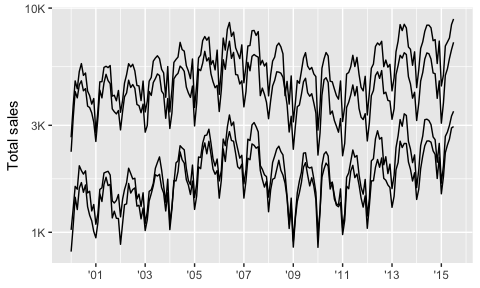
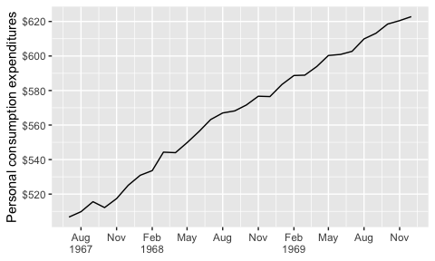
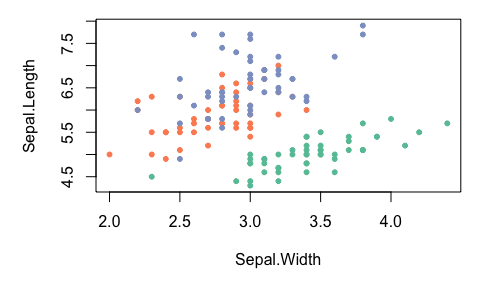
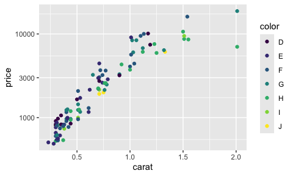

<!-- README.md is generated from README.Rmd. Please edit that file -->

# scales <a href='https://scales.r-lib.org'></a>

<!-- badges: start -->

[](https://CRAN.R-project.org/package=scales)
[](https://github.com/r-lib/scales/actions)
[](https://app.codecov.io/gh/r-lib/scales?branch=main)
<!-- badges: end -->

One of the most difficult parts of any graphics package is scaling,
converting from data values to perceptual properties. The inverse of
scaling, making guides (legends and axes) that can be used to read the
graph, is often even harder! The scales packages provides the internal
scaling infrastructure used by
[ggplot2](https://ggplot2.tidyverse.org/), and gives you tools to
override the default breaks, labels, transformations and palettes.

## Installation

``` r
# Scales is installed when you install ggplot2 or the tidyverse.
# But you can install just scales from CRAN:
install.packages("scales")

# Or the development version from Github:
# install.packages("devtools")
devtools::install_github("r-lib/scales")
```

## Usage

### Breaks and labels

The most common use of the scales package is to customise to control the
appearance of axis and legend labels. Use a `break_` function to control
how breaks are generated from the limits, and a `label_` function to
control how breaks are turned in to labels.

``` r
library(ggplot2)
library(dplyr, warn.conflicts = FALSE)
library(lubridate, warn.conflicts = FALSE)

txhousing %>% 
  mutate(date = make_date(year, month, 1)) %>% 
  group_by(city) %>% 
  filter(min(sales) > 5e2) %>% 
  ggplot(aes(date, sales, group = city)) + 
  geom_line(na.rm = TRUE) + 
  scale_x_date(
    NULL,
    breaks = scales::breaks_width("2 years"), 
    labels = scales::label_date("'%y")
  ) + 
  scale_y_log10(
    "Total sales",
    labels = scales::label_number(scale_cut = scales::cut_short_scale())
  )
```

<!-- -->

``` r
economics %>% 
  filter(date < ymd("1970-01-01")) %>% 
  ggplot(aes(date, pce)) + 
  geom_line() + 
  scale_x_date(NULL,
    breaks = scales::breaks_width("3 months"), 
    labels = scales::label_date_short()
  ) + 
  scale_y_continuous("Personal consumption expenditures",
    breaks = scales::breaks_extended(8),
    labels = scales::label_dollar()  
  )
```

<!-- -->

Generally, I don’t recommend running `library(scales)` because when you
type (e.g.) `scales::label_` autocomplete will provide you with a list
of labelling functions to job your memory.

### Advanced features

Scales colour palettes are used to power the scales in ggplot2, but you
can use them in any plotting system. The following example shows how you
might apply them to a base plot.

``` r
library(scales)
# pull a list of colours from any palette
viridis_pal()(4)
#> [1] "#440154FF" "#31688EFF" "#35B779FF" "#FDE725FF"

# use in combination with baseR `palette()` to set new defaults
palette(brewer_pal(palette = "Set2")(4))
par(mar = c(5, 5, 1, 1))
plot(Sepal.Length ~ Sepal.Width, data = iris, col = Species, pch = 20)
```

<!-- -->

scales also gives users the ability to define and apply their own custom
transformation functions for repeated use.

``` r
# use trans_new to build a new transformation
logp3_trans <- trans_new(
  name = "logp",
  transform = function(x) log(x + 3),
  inverse = function(x) exp(x) - 3,
  breaks = log_breaks()
)

dsamp <- sample_n(diamonds, 100)
ggplot(dsamp, aes(carat, price, colour = color)) +
  geom_point() + 
  scale_y_continuous(trans = logp3_trans)
```

<!-- -->
